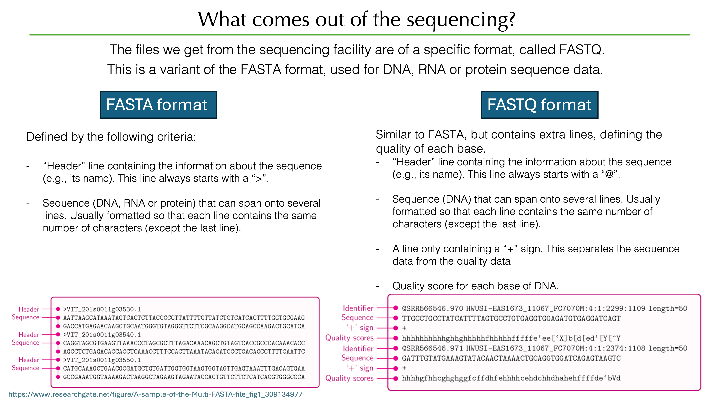

# PRE-PROCESSING THE SEQUENCING DATA
## What do we get from the sequencing platform?
The files we get from the sequencing platform are in FASTQ format, which is a variant of the FASTA format commonly used for sequence data. The FASTQ format has the particularity that each base encoded in the file is associated with a quality score as well, reflecting the "certainty" with which the sequencer has called that specific base.         
     

As you can see on the above image, both FASTA and FASTQ files are simple text files which follow certain rules. You can open them using a simple text editor, or in the command line you can view what is inside using the `cat` or `head` command (to see the whole file, or the first 10 lines, respectively). 

```bash
head examples/example_R1.fastq.gz
```

This will return what seems like a random string of characters. That's because the file is compressed, using `gzip`. We can either unzip the file first (`gunzip`), or use the `zcat` command:

```bash
zcat examples/example_R1.fastq.gz | head
gunzip examples/example_R1.fastq.gz
## Now we can check the content of the file:
head examples/example_R1.fastq
```

To save space on the computer, we will re-zip the files. The programs that are used in bioinformatics are often able to deal with compressed files, so that will not be a problem. 

```bash
gzip examples/example_R1.fastq
```

### Exercise:
Consider a fasta file, which follows the rules:
```
>header_135
SEQUENCESEQUENCESEQUENCESEQUENCESEQUENCESEQUENCESEQUENCESEQUENCESEQUENCESEQUENCESEQUENCESEQUENCESEQUENCESEQUENCE
SEQUENCESEQUENCESEQUENCESEQUENCESEQUENCESEQUENCESEQUENCESEQUENCESEQUENCESEQUENCESEQUENCESEQUENCESEQUENCESEQUENCE
SEQUENCESEQUENCESEQUENCESEQUENCESEQUENCESEQUENCESEQUENCESEQUENCE
>header_2235
SEQUENCESEQUENCESEQUENCESEQUENCESEQUENCESEQUENCESEQUENCESEQUENCESEQUENCESEQUENCESEQUENCESEQUENCESEQUENCESEQUENCE
SEQUENCESEQUENCESEQUENCESEQUENCESEQUENCESEQUENCESEQUENCESEQUENCESEQUENCESEQUENCESEQUENCESEQUENCESEQUENCESEQUENCE
SEQUENCESEQUENCESEQUENCESEQUENCESEQUENCESEQUENCESEQUENCE
>header_42
SEQUENCESEQUENCESEQUENCESEQUENCESEQUENCESEQUENCESEQUENCESEQUENCESEQUENCESEQUENCESEQUENCESEQUENCESEQUENCESEQUENCE
SEQUENCESEQUENCESEQUENCESEQUENCESEQUENCESEQUENCESEQUENCESEQUENCESEQUENCESEQUENCESEQUENCESEQUENCESEQUENCESEQUENCE
SEQUENCESEQUENCESEQUENCESEQUENCESEQUENCESEQUENCESEQUENCESEQUENCESEQUENCESEQUENCESEQUENCESEQUENCESEQUENCESEQUENCE
SEQUENCESEQUENCE
...
```

How would you count the number of sequences in this file? Using the `grep -c` command, what pattern can you use to count the number of sequences?

```bash

```

What about a FASTQ file? 

```bash

```

## Create a directories
Creating a directory can easily be done in the command line using the `mkdir` command, which stands for "make directory".       
```bash
## example
mkdir 0_raw_reads
```

For the purpose of clarity, we will number our directories to reflect the order in which the analysis is done. If you follow `mkdir` with several directory names, it will create all of them at the same time.         

```bash
mkdir 0_raw_reads 1_fastqc 2_adapter_removal 3_dada2 4_taxonomy
```

As you can see, the pre-processing of our amplicon sequencing data has 4 steps:         
1. **Quality check**: using the `FastQC` software, we will examine the quality of our reads.      
2. **Removing adapters**: using `cutadapt` we will remove the illumina adapters, and the primers that were used in the amplification.      
3. **Denoising**:        
4. **Assigning taxonomy**:      

## Downloading our data

## Creating a metadata file

```bash
mkdir metadata

```

## 1. Quality check
Of course, we don't want to look at the quality of the data with our naked eyes. For this, we will use the FastQC software, which will create a quality report for each of our `.fastq` files.      
Because we have to execute that on each of our files, we are going to use a `for` loop, which will automatically loop over our files and create the associated reports. 

```bash
mkdir -p 1_fastqc/tmp/
for sample in $(cat metadata/sample-metadata.tsv); do
    echo $sample;
    fastqc --outdir 1_fastqc/ --dir 1_fastqc/tmp/ --extract -t 15 0_raw_reads/$sample*R1* 0_raw_reads/$sample*R2*
    echo "Quality analysis (FASTQC) finished for sample $sample"
done
```

Let's take a look at the results. The reports are in html format, so you can simply open them in a browser. 

```bash
safari 1_fastqc/<insert_html_file_here>.html
```

In this case, we only have 20 files, but even so checking them one by one would be a little tedious. We can use `multiqc` to create a combined report for all the `fastqc` reports:

```bash
multiqc 1_fastqc --outdir 1_fastqc --filename 1_multiqc_report.html
safari 1_fastqc/1_multiqc_report.html
```

## 2. Removing adapters and filtering
**image of why we remove adapters and primers**

Maybe I can use my 2_cutadapt script, which does everything for them. Cause Cutadapt is pretty hard to explain... 
```bash
mkdir -p 2_adapter_removal/fastqc/tmp/

$TRIM_GAL --quality 0 --phred64 --nextera --trim-n --fastqc --fastqc_args "--outdir 2_adapter_removal/trim_galore/fastqc --dir 2_adapter_removal/trim_galore/fastqc/tmp/ --extract -t 15" --output_dir 2_adapter_removal/trim_galore/ --paired 0_raw_reads/*fastq.gz


```

## 3. Denoising

```bash
for fastq in filtered; do
    vsearch --cluster_unoise 
done
```